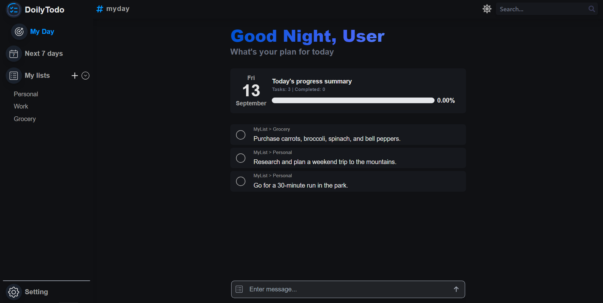

# React Dexie Todo App

This is a simple Todo application built with React and Dexie.js. The application allows users to manage their daily and weekly tasks efficiently.

## Features

- Add, edit, and delete tasks
- Organize tasks into lists
- View tasks for the next 7 days
- Persistent storage using Dexie.js (IndexedDB wrapper)

## Screenshots



## Getting Started

These instructions will help you set up the project on your local machine for development and testing purposes.

### Prerequisites

Make sure you have the following software installed:

- [Node.js](https://nodejs.org/)
- [npm](https://www.npmjs.com/)

### Installation

1. Clone the repository:
   ```sh
   git clone https://github.com/Ask-er/react-dexie-todo-app.git
   cd react-dexie-todo-app
   ```
2. Install the dependencies:
   ```sh
   npm install
   ```
3. Start the development server:

```sh
npm start
```

4. Open your browser and navigate to http://localhost:5173/

### Contact

- If you have any questions or feedback, feel free to reach out to me at [your-email@example.com].
